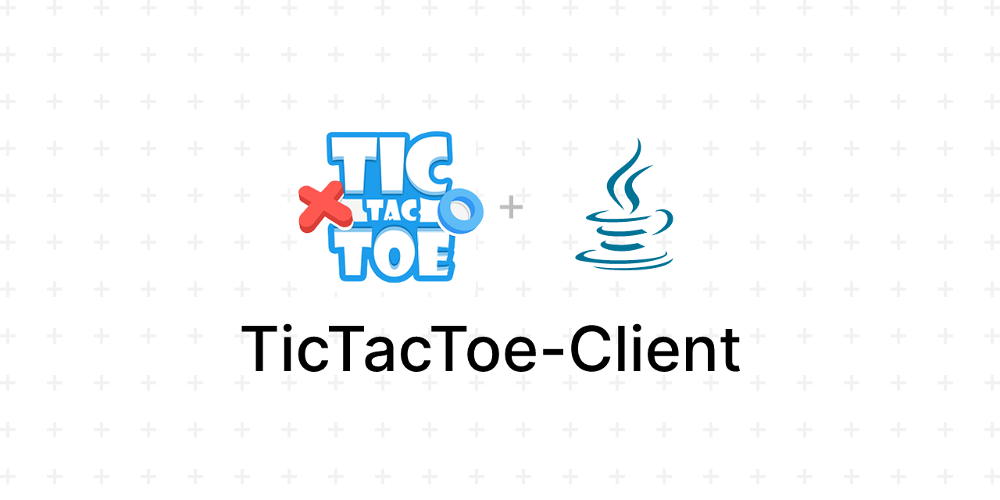

# Network-Based Tic-Tac-Toe Application

## Overview
The Network-Based Tic-Tac-Toe Application is a Java-based game that allows users to enjoy the classic Tic-Tac-Toe game in various modes. The application supports single-player, local multiplayer, and online multiplayer modes, ensuring a fun and interactive experience for players. With elegant design and rich features, the application is perfect for players of all ages.

---

## Features
### Game Modes:
1. **Single-Player Mode:**
   - Play against the computer.
   - Bonus: Adjustable difficulty levels using an AI Java library.

2. **Local Multiplayer Mode:**
   - Play with another player on the same machine.

3. **Online Multiplayer Mode:**
   - View a list of available online players.
   - Send game requests to other players.
   - Receive game requests and accept or decline them.

---

### Additional Features:
- **Elegant User Interface:**
  - Intuitive and visually appealing interface for seamless user interaction.

- **Game Recording and Replay:**
  - Record games to review or replay them later.

- **Bonus Videos:**
  - Award players with motivational or celebratory videos when they win a match.

- **Player Score Tracking:**
  - Track and store player scores for future reference.

- **User Authentication:**
  - Players can register and log in to the server to access online features.
  
---

## Installation and Setup

### Prerequisites:
- Java Development Kit (JDK) installed on your machine.
- Internet connection for online multiplayer mode.

### Steps:
1. Clone the repository or download the source code.
2. Open the project in your preferred Java IDE (e.g., IntelliJ IDEA, Eclipse).
3. Download the required JSON library from the following link:
   [Download Json.jar](https://repo1.maven.org/maven2/org/json/json/20250107/json-20250107.jar).
4. Add the `json-20250107.jar` to your project's classpath.
5. Build and run the server application to initialize the server.
6. Launch the client application for the Tic-Tac-Toe game.
7. Register or log in to access online multiplayer features.
8. Enjoy the game in single-player, local multiplayer, or online multiplayer modes.

---

## How to Play
1. Select a game mode:
   - Single-Player
   - Local Multiplayer
   - Online Multiplayer
2. Follow the in-game instructions for your selected mode.
3. For online mode:
   - Choose an opponent from the list of available players.
   - Accept or decline game requests from other players.
4. Play the game and aim to win!
5. View game replays or enjoy bonus videos after winning.

